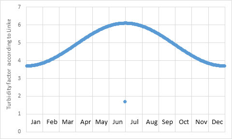
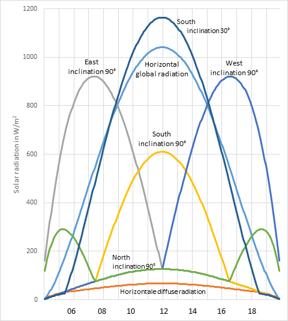
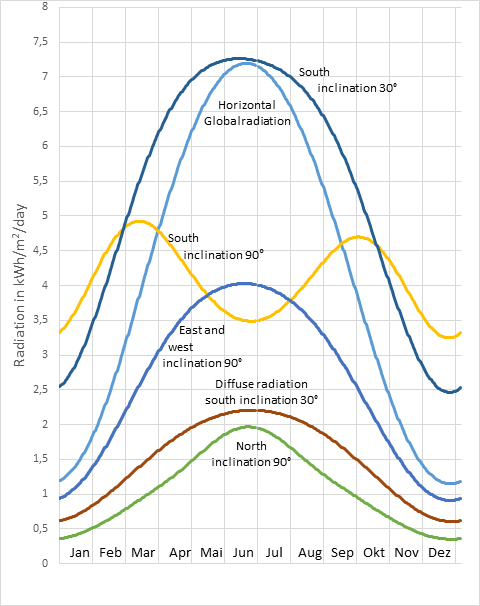

# Calculation of solar radiation on a surface with any orientation and inclination according to VDI 6007-3

Engin Bagda, www.heizen-co2-sparen.de

The code SunSimulation_VDI_6007_3.py calculates the daily and yearly solar
irradiance on a surface with any orientation and inclination for a given place,
located by its longitude and latitude. The code is based on standard
VDI 6007-3:2015, confirmed 2021 “Calculation of transient thermal response of
rooms and buildings – modelling of solar radiation”. This code differs from
DIN 5034-2 “Daylight in interiors-Principles” explained in
https://github.com/Heating-and-cooling/sun_daily in the calculation of the
amount of diffuse radiation to inclined surfaces.

Figure 1: Turbidity factors according to Linke over the year with a measured
minimum value at day number 181

To calculate from horizontal diffuse radiation to a surface with any orientation
and inclination VDI-6007-3 uses conversions factors R. These differ for clear
and overcast skies.
For skies with mixed clouds is a coefficient SSW for solar probability is used.
SSW can be between `1` for totally clear sky and `0` for totally overcast days.
In the code SSW can be changed. In average for the year a value of 0.7 for SSW
is appropriate.
The code generates an Excel file `SunRadiation.xlsx`. This includes a sheet
`Solar_radiance` for the solar radiation on a chosen day to different oriented
surfaces with different inclinations, calculated in steps of 5 minutes
(see figure 2).

Figure 2: Solar radiation at day number 180 (30.June) for the place Mannheim
with SSW: 1 and TF: 1.9

In the sheet ‘Daily-Values’ are the daily values for the solar radiation on
different oriented surfaces with different inclinations (see figure 3).

Figure 3: Daily solar radiation for the place Mannheim with SSW: 1 and TF: 1.9

For more information to the code SunSimulation_VDI_6007_3.py see: [Berechnen der
solaren Bestrahlungsstärke auf beliebig geneigte Flächen in Anlehnung an VDI
6007-3 - Heizen-Kühlen-Sparen (heizen-co2-sparen.de)](https://www.heizen-co2-sparen.de/grundlagen-der-berechnung/vdi-6007-3)
